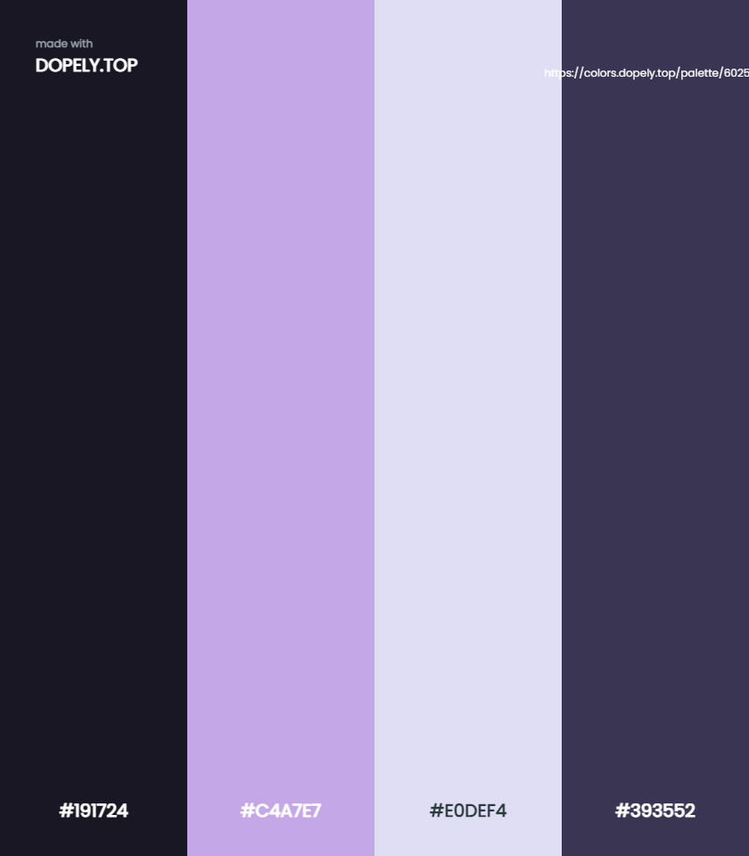

# Color Palette for my portfolio 

## link to my color palette, hex values were copied from (https://rosepinetheme.com/palette) and pasted into:

[my color palette](https://colors.dopely.top/palette-generator/Qb0dEfHxenA)

## image of my color palette

## all colors were used from the site listed in the assignment information section of notes. 

## this assignment revolves around an index  page, that can access an About link and Docs link for future use, and the same for the note.html file. 
## the note.html file is where notes will be written, and will be saved if needed. there will also be a delete button incase the notes you have written are not needed.
## there is also a slide out bar with a button to access the note files you have saved.